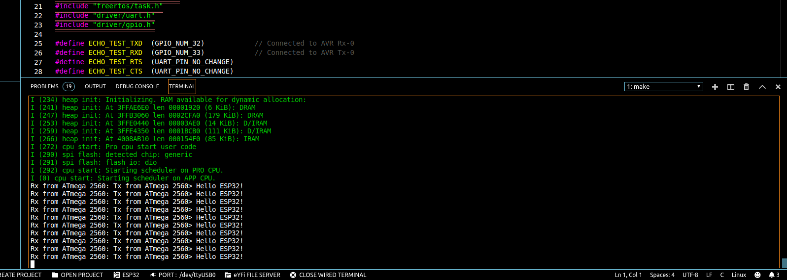
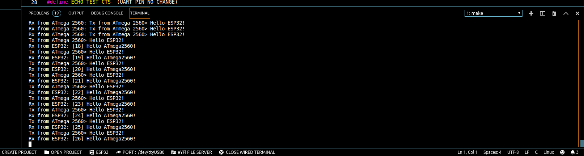

# UART Communication between ESP32 and ATmega 2560

In this Quick Byte you can find the source code for ATmega 2560 and ESP32 in which they communicate with each other via UART with baud rate of 115200.

### Connection

In ATmega 2560, UART #0 is connected to UART #1 of ESP32.

### Program

In this Quick Byte, the ATmega 2560 is sending the following data on UART #0 every second,

**"Tx from ATmega 2560> Hello ESP32!"**

ATmega 2560 is also echoing back any data which it is receiving on UART #0.

Whenever ESP32 receives the data from ATmega 2560 on its UART #1, it sends back the following message as ACK to ATmega 2560,

**"Rx from ESP32: [n] Hello ATmega2560!"**

where n is a integer which increments.

### Run

After you flash the code you can use the Wired Serial Terminal to see the data coming from either of the controller. But, make sure to switch S3 towards W_ESP if you check data coming from ESP32 and towards W_AVR if you want to check data coming from ATmega 2560.

Also make sure the S1 switch notch is towards the Wi-Fi symbol, which ensures that ATmega 2560 UART#0 is connected to ESP32 UART#1.

We recommend you to use "make monitor" command instead of Wired Serial Monitor for this project.

When you are in the ESP32 project run **make monitor** command in the terminal to start serial terminal of ESP32.

If S3 is switched towards W_ESP, you will receive the following text on the terminal,

**Rx from ATmega 2560: Tx from ATmega 2560> Hello ESP32!**

When you switch S3 towards W_AVR, you will receive the following text on the terminal,

**Tx from ATmega 2560> Hello ESP32!** 

**Rx from ESP32: [19] Hello ATmega2560! **

